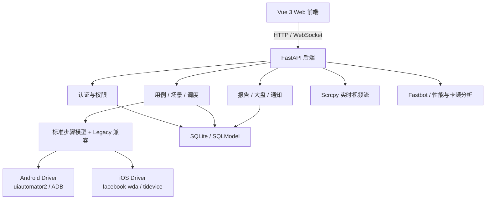

# AutoDroid

AutoDroid 是一个面向 Android/iOS 的低代码 UI 自动化测试平台，覆盖设备管理、可视化录制、用例与场景编排、跨端执行、定时调度、稳定性探索、报告分析和通知闭环。

当前产品边界是：**Android 支持实时投屏或静态截图录制，iOS 支持基于 WebDriverAgent 的静态截图录制；Android/iOS 均支持执行**。iOS 暂不支持实时投屏。同一套标准步骤可以按平台分发，并通过预检提前发现动作、定位器、变量、应用映射和 WDA 状态问题。

## 核心能力

| 业务域 | 主要能力 |
|---|---|
| 设备中心 | Android/iOS 设备发现与同步、设备状态、截图、解锁、重启、iOS WDA 检查与启动 |
| 可视化录制 | Android 实时投屏/静态截图录制；iOS 静态截图、元素审查、交互录制与单步调试 |
| 用例管理 | 目录与标签、复制、变量、标准步骤模型、平台覆盖、执行前预检、运行中止 |
| 场景编排 | 多用例串联、变量上下文传递、多设备并发、设备级预检过滤 |
| 跨端执行 | Android 使用 uiautomator2，iOS 使用 facebook-wda；支持统一动作与平台定位覆盖 |
| 调度中心 | 单次、每天、每周、循环任务；支持 UI 场景和 Fastbot 任务 |
| 智能稳定性 | Fastbot 探索、Crash/ANR、CPU/内存、framestats 卡顿检测、回放与 Trace 分析 |
| 报告与大盘 | 用例/场景执行详情、失败截图、HTML 报告、趋势与设备状态概览 |
| AI 辅助 | 自然语言生成测试步骤、Fastbot 日志根因分析、OpenAI 兼容接口 |
| 系统管理 | JWT 登录、管理员用户管理、公开注册开关、资源删除权限、飞书通知 |
| 移动端访问 | 移动端登录、运行概览、设备状态、用例/场景执行和报告查看 |

## 技术架构



### 技术栈

| 层级 | 技术 |
|---|---|
| 前端 | Vue 3、Element Plus、Vite、Pinia、ECharts |
| 后端 | Python、FastAPI、SQLModel、SQLite、APScheduler |
| Android | ADB、uiautomator2、adbutils、Scrcpy |
| iOS | tidevice、facebook-wda、WebDriverAgent |
| 图像与性能 | OpenCV、Pillow、Perfetto、framestats |
| 实时通信 | WebSocket、H.264 视频流 |
| 报告与通知 | Jinja2 HTML 报告、飞书机器人 Webhook |

## 平台能力矩阵

| 能力 | Android | iOS | 说明 |
|---|---|---|---|
| 设备发现与管理 | 支持 | 支持 | iOS 状态包含 `WDA_DOWN` |
| 静态截图录制 | 支持 | 支持 | iOS 通过 WDA 获取截图和页面层级，交互后刷新截图 |
| 实时投屏录制 | 支持 | 暂不支持 | Scrcpy 实时画面与触控仅用于 Android |
| 用例执行 | 支持 | 支持 | iOS 需开启执行开关且 WDA 健康 |
| 场景并发执行 | 支持 | 支持 | 执行前按设备进行预检 |
| 图像/OCR 步骤 | 支持 | 支持 | 具体动作与参数见执行规范 |
| 实时 Scrcpy 画面 | 支持 | 不支持 | 用于 Android 预览和触控 |
| Fastbot 探索 | 支持 | 不支持 | Android 专项能力 |

## 移动端适配

Web 前端支持 PC、移动和自动识别三种客户端模式。自动模式会在视口宽度不超过 `768px` 或检测到触控型指针时启用移动布局，用户也可以通过页面上的客户端模式开关手动切换，选择结果会保存在浏览器本地。

移动端定位为“查看与轻量执行入口”，目前支持：

- 登录、注册和退出登录
- 运行概览、KPI、最近异常与最近执行
- Android/iOS 设备状态、设备同步、快照、iOS WDA 启动/检测和设备解锁
- 用例搜索、分页、选择设备与环境并发起执行
- 场景搜索、状态筛选、执行场景和查看最近报告
- UI/Fastbot 报告列表、状态筛选以及报告详情和失败截图查看
- 固定底部导航：概览、设备、用例、场景、报告

移动端暂不提供用例编辑、场景复杂编排、变量与安装包管理、定时任务、专项测试、用户管理和系统配置。这些页面会提示切换到 PC 模式。

## 项目结构

```text
AutoDroid/
├── backend/
│   ├── api/                    # 认证、用例、场景、设备、报告、任务等 API
│   ├── device_stream/          # Scrcpy 视频流、设备监听与触控转发
│   ├── drivers/                # Android/iOS 驱动与跨端执行器
│   ├── templates/              # 用例与场景 HTML 报告模板
│   ├── tests/                  # 后端自动化测试
│   ├── main.py                 # FastAPI 入口、录制接口、WebSocket、SPA 托管
│   ├── models.py               # SQLModel 数据模型
│   ├── runner.py               # Legacy 执行链路
│   ├── step_contract.py        # 标准步骤与 Legacy 步骤转换
│   ├── scheduler_service.py    # APScheduler 定时调度
│   └── fastbot_runner.py       # Fastbot 与性能监控执行引擎
├── frontend/
│   ├── src/api/                # HTTP API 封装
│   ├── src/components/         # 设备画面、步骤编辑、日志等公共组件
│   ├── src/layout/             # 桌面端与移动端布局
│   ├── src/stores/             # 用户与用例状态管理
│   └── src/views/              # 设备、用例、场景、任务、报告等页面
├── docs/
│   ├── PROJECT_OVERVIEW_CN.md  # 深度架构与实现说明
│   ├── EXECUTION_SPEC.md       # 标准步骤、动作矩阵和错误码
│   └── IOS_WDA_OPS.md          # iOS WDA 运维手册
├── scripts/start_lan.sh        # 构建前端并启动一体化服务
├── resources/                  # Fastbot 与 Scrcpy 运行资源
├── requirements*.txt           # 全量及分能力 Python 依赖
└── README.md
```

`database.db`、`reports/`、`uploads/`、`static/images/` 和运行日志属于本地数据或生成物，不应作为源码提交。

## 快速开始

### 环境要求

- Python 3.9+，推荐使用 Python 3.10 或更新版本
- Node.js `^20.19.0` 或 `>=22.12.0`
- npm
- Android：已安装 ADB，设备已开启 USB 调试并授权当前主机
- iOS：设备已信任当前主机，已安装并可启动 WebDriverAgent；首次构建或修复 WDA 推荐使用 macOS + Xcode

### 1. 安装后端依赖

推荐使用虚拟环境：

```bash
python3 -m venv .venv
source .venv/bin/activate
python -m pip install --upgrade pip
pip install -r requirements.txt
```

`requirements.txt` 会安装完整能力。也可以按部署目标组合安装：

```bash
# 后端基础能力
pip install -r requirements-base.txt

# 按需追加
pip install -r requirements-android.txt
pip install -r requirements-ios.txt
pip install -r requirements-ai.txt
```

### 2. 一体化启动

```bash
bash scripts/start_lan.sh
```

脚本会在缺少 `frontend/node_modules` 时安装前端依赖、构建 `frontend/dist`，然后由 FastAPI 同时提供 API 和前端页面。

- 本机访问：`http://127.0.0.1:8000`
- API 文档：`http://127.0.0.1:8000/docs`
- 局域网访问：启动日志会输出当前主机地址

可用启动参数：

```bash
HOST=127.0.0.1 PORT=9000 bash scripts/start_lan.sh
SKIP_BUILD=1 bash scripts/start_lan.sh
PYTHON_BIN=/path/to/python bash scripts/start_lan.sh
```

### 3. 开发模式

后端：

```bash
source .venv/bin/activate
uvicorn backend.main:app --host 0.0.0.0 --port 8000 --reload
```

前端：

```bash
cd frontend
npm install
npm run dev -- --host
```

开发模式默认访问 `http://127.0.0.1:5173`，Vite 会将 `/api` 和 `/ws` 代理到 `127.0.0.1:8000`。

### 4. 首次登录

后端首次启动时会自动创建管理员：

```text
用户名：admin
密码：123456
```

登录后请立即在账号设置中修改密码。对外部署前还必须替换 `backend/core/security.py` 中的 JWT `SECRET_KEY`，并根据需要关闭公开注册。

## 推荐使用流程

1. 在设备中心同步 Android/iOS 设备并确认状态。
2. 在 App 包管理和全局变量库中维护应用与环境数据。
3. 使用 Android 实时投屏/静态截图或 iOS 静态截图录制用例，补充断言、图像、OCR、等待和容错策略。
4. 为跨端步骤设置 `execute_on` 和 `platform_overrides`，运行预检后执行用例。
5. 将多个用例编排为场景，通过场景上下文传递运行时变量。
6. 选择一台或多台设备执行场景；不满足条件的设备会被预检过滤。
7. 在定时任务中创建单次、每日、每周或循环任务。
8. 在报告中心和运行大盘查看结果、失败截图、趋势和设备告警。

## 执行模型

项目同时保留 Legacy Android 执行链路和标准跨端执行链路，以兼容历史数据并支持灰度迁移。

标准步骤主要包含：

- `action`、`args`、`timeout`、`description`
- `execute_on`：允许执行的平台
- `platform_overrides`：Android/iOS 专属定位器或参数
- `error_strategy`：`ABORT`、`CONTINUE`、`IGNORE`

当前统一支持点击、输入、元素等待、文本/图像断言、图像点击、OCR 提取、滑动、返回、主页、应用启停等动作。详细参数、平台差异、状态语义与错误码见 [执行规范](docs/EXECUTION_SPEC.md)。

### Feature Flags

以下开关存储在 `SystemSetting` 中，用于逐步启用新链路：

| 配置项 | 作用 |
|---|---|
| `new_step_model` | 启用标准步骤表的读写与兼容迁移 |
| `cross_platform_runner` | 将执行入口切换到跨端 Runner |
| `ios_execution` | 允许 iOS 执行 |

生产环境建议按“标准步骤模型 -> 跨端 Runner -> iOS 执行”的顺序灰度启用。

## 配置说明

### 环境变量

| 变量 | 默认值 | 说明 |
|---|---|---|
| `AUTODROID_DB_PATH` | `database.db` | SQLite 文件路径，相对路径基于项目根目录 |
| `HOST` | `0.0.0.0` | `start_lan.sh` 监听地址 |
| `PORT` | `8000` | `start_lan.sh` 服务端口 |
| `SKIP_BUILD` | `0` | 设置为 `1` 时跳过前端构建 |
| `PYTHON_BIN` | 自动检测 | 指定启动后端的 Python 可执行文件 |
| `IOS_WDA_XCODEPROJ_PATH` | 自动发现 | 指定 WebDriverAgent `.xcodeproj` 路径 |
| `AUTODROID_TRACE_PROCESSOR_BIN` | 自动发现 | 指定 Perfetto `trace_processor_shell` |

### 系统设置

前端“系统配置”页面支持维护：

- UI 场景报告和 Fastbot 报告的飞书 Webhook
- 通知卡片使用的系统访问地址
- AI 服务的 API Key、Base URL 和模型名称
- 通知与 AI 连接测试

iOS WDA URL、设备映射、启动参数和故障处理见 [iOS WDA 运维手册](docs/IOS_WDA_OPS.md)。

## API 与兼容性

- OpenAPI：`GET /docs`
- 主要业务 API：`/api/auth`、`/api/cases`、`/api/scenarios`、`/api/devices`、`/api/tasks`、`/api/reports`、`/api/fastbot`
- 实时执行与视频流：`/ws/*`
- 部分无 `/api` 前缀的路由继续保留，用于兼容历史客户端

前端和新集成建议统一使用 `/api` 前缀，不要继续依赖兼容别名。

## 验证与测试

运行后端测试：

```bash
source .venv/bin/activate
python -m unittest discover -s backend/tests -p 'test_*.py'
```

验证前端生产构建：

```bash
cd frontend
npm run build
```

提交前建议至少运行与改动模块相关的后端测试，并完成一次前端构建。

## 文档索引

- [项目深度说明](docs/PROJECT_OVERVIEW_CN.md)：功能全景、核心实现、数据模型与运维建议
- [执行规范](docs/EXECUTION_SPEC.md)：标准步骤模型、动作参数、平台覆盖与错误码
- [iOS WDA 运维手册](docs/IOS_WDA_OPS.md)：WDA 启动、健康检查、端口映射和故障排查

## 安全与仓库维护

- 不要提交真实 API Key、Webhook、访问令牌、用户数据库或设备隐私数据。
- 不要提交 `database.db`、`reports/`、`uploads/`、运行日志、PID 文件、APK/IPA 等本地产物。
- 默认管理员账号和静态 JWT 密钥仅适用于本地首次启动，部署前必须修改。
- 公开部署时应限制 CORS、启用 HTTPS，并通过网络策略限制设备控制接口的访问范围。
